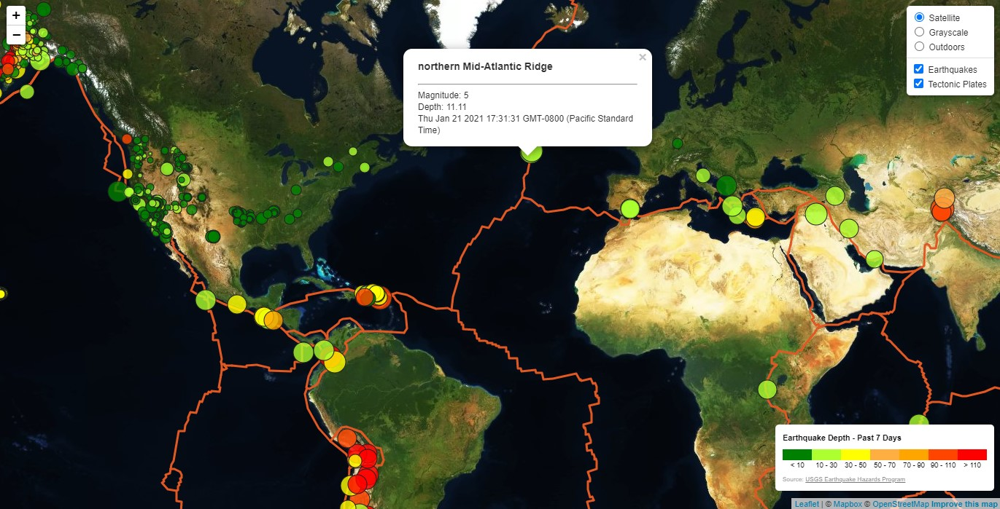

# Earthquake Intensity Mappings

- **_USGS Earthquake Mapping_** - Is based off USGS Earthquake Hazards Program data from the [USGS GeoJson](https://data.census.gov/cedsci/) summary page for the category of significant earthquakes for the past 7 days. The goal in the visualizations is to map not only the magnitude of the earthquakes but also the depth. The images provided outline a simple map which shows the earthquake mapping and a secondary map with controls to change the map layers and optionally remove/add both earthquake or tectonic plate information. The rendering of the map, legends, and controls were accomplished through the usage of a javascript library called [Leaflet](https://leafletjs.com/) and as a map layer [Mapbox](https://www.mapbox.com/) APIs were used to render the various maps.

## Files

- Basic Mapping

  - [`Leaflet-Step-1/index.html`](Leaflet-Step-1/index.html) - Index page that has the base html and javascript libraries including the div element to place the map

  - [`Leaflet-Step-1/static/js/logic.js`](Leaflet-Step-1/static/js/logic.js) - The primary application code file, it contains the code to call the map APIs, USGS geoJson APIs, and adds the map and legend to the [`Leaflet-Step-1/index.html`](Leaflet-Step-1/index.html)

  - [`Leaflet-Step-1/static/css/style.css`](Leaflet-Step-1/static/css/style.css) - The custom styling applied to the html elements for the legend and page

- Mapping with Controls

  - [`Leaflet-Step-2/index.html`](Leaflet-Step-2/index.html) - Index page that has the base html and javascript libraries including the div element to place the map

  - [`Leaflet-Step-2/static/js/logic.js`](Leaflet-Step-2/static/js/logic.js) - The primary application code file, it contains the code to call the map APIs, USGS geoJson APIs, and adds the map, legend, and controls to the [`Leaflet-Step-1/index.html`](Leaflet-Step-2/index.html)

  - [`Leaflet-Step-2/static/css/style.css`](Leaflet-Step-2/static/css/style.css) - The custom styling applied to the html elements for the legend and page

  - [`Leaflet-Step-2/static/data/PB2002_boundaries.json`](Leaflet-Step-2/static/data/PB2002_boundaries.json) - The geoJson data for the tectonic plates of the entire earth

## Results

- Basic Mapping

  

- Mapping with Controls

  

  

  

  
